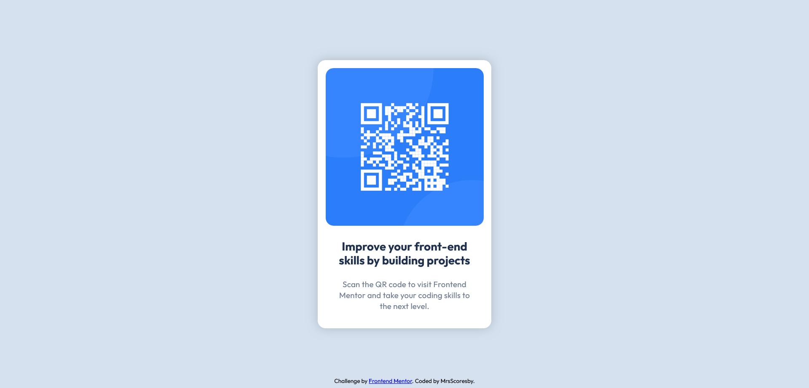

# Frontend Mentor - QR code component solution

This is a solution to the [QR code component challenge on Frontend Mentor](https://www.frontendmentor.io/challenges/qr-code-component-iux_sIO_H). Frontend Mentor challenges help you improve your coding skills by building realistic projects. 

## Table of contents

  - [Screenshot](#screenshot)
  - [Links](#links)
  - [My process](#my-process)
  - [Built with](#built-with)
  - [What I learned](#what-i-learned)
  - [Continued development](#continued-development)
  - [Useful resources](#useful-resources)
  - [Author](#author)

### Screenshot

### Links

- Solution URL: [Add solution URL here](https://your-solution-url.com)
- Live Site URL: [Add live site URL here](https://your-live-site-url.com)

## My process

1. I started by doing the easiest thing which was adding the background colors.
2. I had to figure out how to center things on the page. I've used display and position before but never on my own, always following tutorials, so I had to look up which one would work best (or at all).
3. It was a lot of trial and error before I found an acceptable position. Padding, margin, all went into it trying to get as close to the original as possible.
4. Had to look up and learn about adding font-family from the Google link. I was and still am a little confused about the bold aspect/different weights, I'm not sure I did that one right.
5. The Figma file was a new experience as well. I need to watch a few explanations about how to use the software at all, but it was helpful for the typography and color information.
6. I added shadow but that I had to check different sources for as well, I'm not familiar with it.
7. Lastly, I tried to make sure the footer wouldn't move, but when I couldn't, I just kept it behind the div.
8. Trying to commit to the right repository is proving to be a challenge.

### Built with

- Semantic HTML5 markup
- CSS custom properties

### What I learned

The most valuable lesson here is that I still need to study more about display and position. Fonts, colors, padding I understand, just need more practice so I don't have to go through trial-and-error all the time. It was very interesting using a Figma file for the first time! That's another thing I need to get used to.

I can tell, from this exercise, that I have a long way to go still. But getting the page done made me very happy, so I know it will be worth it spending a lot more time studying how to get things the way I want them to be.

### Continued development

Definitely need to work on learning more. For now, as a beginner, I want to focus on getting the most basic things done.

### Useful resources

- [Alex the Analyst YouTube video](https://www.youtube.com/watch?v=SwtL-6w-B5c) - I had to look up how to use Git and GitHub and this series was really helpful.
- [W3 Schools](https://www.w3schools.com/html/html_basic.asp) - One of the pages I've used the most so far, it helps understand the most basic concepts.

## Author

- Frontend Mentor - [@mrscoresby](https://www.frontendmentor.io/profile/mrscoresby)
